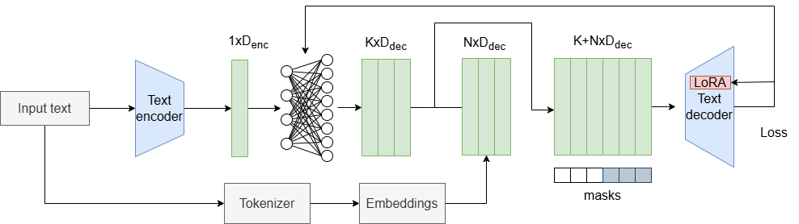
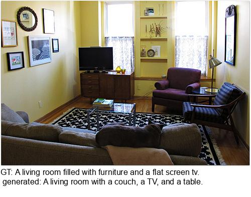

## Capincho ##

Image captioning composed of 3 modules: 1) a decoder only language model (OPT) for generating text, 2) a vision-language model CLIP for aligned representation of images and texts, 3) a embeddings mapper 
that maps CLIP embeddings to k OPT word embeddings.  



Some examples from coco dataset, after training for 2 epochs only while learning a prefix of length 10 (k=10):



### Installation ###
1. create python 3.12 env

````angular2html
conda create -n capincho python=3.12
````

2. install cuda toolkit 11.8
````angular2html
conda install conda-forge::cudatoolkit
````

3. install pytorch compatible with cuda
````angular2html
pip install torch torchvision torchaudio --index-url https://download.pytorch.org/whl/cu118

````

4. install requirements
````angular2html
pip install -r requirements.txt
````

5. install radgraph compatible with python 3.12, for mimic evaluation
````angular2html
conda install git
pip install git+https://github.com/aehrc/radgraph.git
````

### Usage ###
check the following files:

**extractFeatures.py** to extract the features vectors from coco dataset using CLIP or open CLIP.

**trainDecoder.py**  to train the mapper module and finetune OPT, or a OPT LoRA model.

**evaluateCaptioning.py** to qualitative evaluate results.

